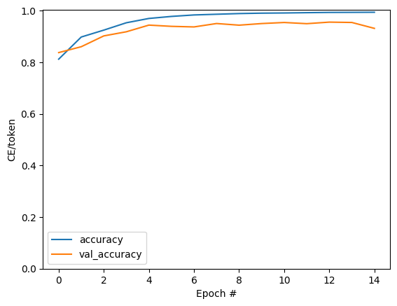
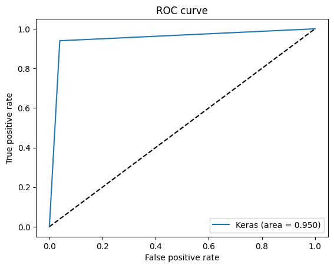

# Siamese Network for cattle identification

## Description
This project implements a Siamese neural network for image similarity comparison of various cattle mainly focussing on cows using TensorFlow and Keras.
It take the muscle features of a cow as reference to check the similarity score.

## Installation
To run this code, make sure you have Python installed. Install the required dependencies using pip:

```bash
pip install -r requirements.txt
```
To use this code, follow these steps:


## Useage
1) Clone the repository :
  ```bash
  git clone https://github.com/your_username/cow-muzzle-siamese.git
```
3) Install dependencies :
```bash
  pip install -r requirements.txt
```
5) Run the main script :
```bash
  python main.py
```
## Model Architecture
The Siamese neural network architecture consists of convolutional layers followed by fully connected layers. The model takes pairs of muzzle images, processes them through the encoder, calculates the cosine similarity between their embeddings, and outputs a binary classification result.

## Graphs

### Training and Validation Loss


This graph shows the training and validation loss over epochs during the training process. Lower loss values indicate better performance of the model.

### Training and Validation Accuracy



This graph illustrates the training and validation accuracy over epochs. Higher accuracy values indicate better performance of the model in classifying muzzle images.

### ROC Curve



The Receiver Operating Characteristic (ROC) curve plots the true positive rate against the false positive rate for various threshold settings. It helps visualize the performance of the model in binary classification tasks.

## Training Details

- **Number of Epochs**: 15
- **Batch Size**: 64

The model was trained for 15 epochs with a batch size of 64. Adjustments to hyperparameters such as epochs and batch size can impact the model's performance and training time.


